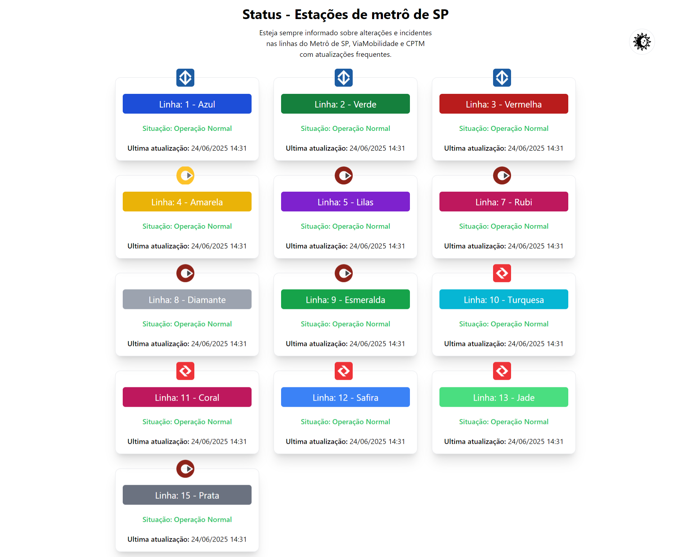

# 🚇 SpNosTrilhos

Aplicação Angular 18 que exibe em tempo real o status das linhas do Metrô, CPTM e ViaMobilidade em São Paulo, consumindo a API pública do site Diretodostrens.com.br.

👉 [Clique aqui para ver o projeto online](https://sp-nos-trilhos.vercel.app/)  

---

## 📌 Funcionalidades

- ✅ Visualização do status de todas as linhas de metrô e trem
- 🟢 Destaque visual para linhas com "Operação Normal"
- 🔴 Destaque e descrição para linhas com falhas ou manutenção
- 🌙 Suporte a **modo escuro** (dark mode)
- 🖼️ Ícones e cores específicas por linha (ex: Azul, Vermelha, Coral...)
- 🔁 Atualização dinâmica via API
- 📱 Responsivo (mobile e desktop)

---

## 🔧 Tecnologias

- [Angular 18](https://angular.io)
- [Tailwind CSS](https://tailwindcss.com)
- [RxJS](https://rxjs.dev)
- [API Direto dos Trens](https://www.diretodostrens.com.br/api/status)
- TypeScript, HTML, CSS

## 👤 Autor
Desenvolvido por [william araujo]
